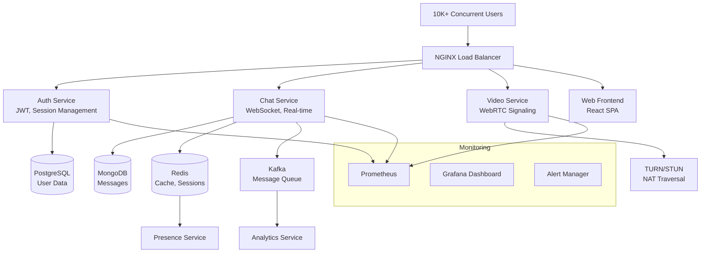
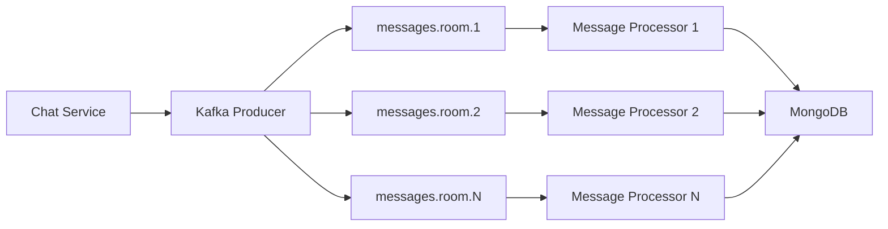

# 🏗️ Real-Time Chat Platform Architecture

## Overview

This document outlines the architecture of a production-ready real-time chat and video calling platform designed to handle **10,000+ concurrent users** with sub-100ms message latency and 99.9% uptime.

## 🎯 System Requirements

### Functional Requirements
- **Real-time messaging**: Sub-100ms message delivery
- **Video/Voice calling**: WebRTC-based P2P communication
- **User authentication**: JWT-based with session management
- **Message persistence**: Chat history with search capabilities
- **Presence system**: Online/offline status tracking
- **Room management**: Public/private chat rooms
- **File sharing**: Image/document upload and sharing

### Non-Functional Requirements
- **Scalability**: 10K concurrent WebSocket connections
- **Latency**: <100ms message delivery, <2s connection establishment
- **Availability**: 99.9% uptime (8.76 hours downtime/year)
- **Throughput**: 100K messages/minute peak load
- **Storage**: 1TB+ message history, efficient retrieval
- **Security**: End-to-end encryption, rate limiting, DDoS protection

## 🏛️ High-Level Architecture



## 📊 Data Flow Architecture

### Message Flow
1. **Client → Load Balancer**: HTTPS/WSS termination
2. **Load Balancer → Chat Service**: Route to appropriate instance
3. **Chat Service → Kafka**: Async message processing
4. **Kafka → MongoDB**: Message persistence
5. **Chat Service → Redis**: Cache active room data
6. **Chat Service → Clients**: Real-time broadcast via WebSocket

### Authentication Flow
1. **Client → Auth Service**: Login credentials
2. **Auth Service → PostgreSQL**: User validation
3. **Auth Service → Redis**: Session creation
4. **Auth Service → Client**: JWT token
5. **Client → Any Service**: JWT in Authorization header

## 🔧 Component Architecture

### 1. Authentication Service
**Tech Stack**: Node.js, Express, PostgreSQL, Redis, JWT

**Responsibilities**:
- User registration/login
- JWT token generation/validation
- Session management
- Password hashing (Argon2)
- Rate limiting (per-IP, per-user)

**Scaling Strategy**:
- Stateless design for horizontal scaling
- Redis for session storage
- Database connection pooling
- JWT for distributed authentication

### 2. Chat Service
**Tech Stack**: Node.js, Socket.io, MongoDB, Redis, Kafka

**Responsibilities**:
- WebSocket connection management
- Real-time message broadcasting
- Room management
- Message persistence
- Presence tracking

**Scaling Strategy**:
- Socket.io adapter with Redis
- Kafka for message queuing
- MongoDB sharding by room_id
- Connection pooling

### 3. Video Service
**Tech Stack**: Node.js, WebRTC, TURN/STUN, Redis

**Responsibilities**:
- WebRTC signaling
- Call state management
- Bandwidth optimization
- Recording management

**Scaling Strategy**:
- Stateless signaling server
- TURN server clustering
- Media server scaling (Janus/Kurento)

### 4. Load Balancer
**Tech Stack**: NGINX

**Responsibilities**:
- SSL termination
- Rate limiting
- Caching static assets
- Health checks
- Failover routing

**Configuration**:
- Least connections for API
- IP hash for WebSocket (sticky sessions)
- Circuit breaker pattern

## 🗄️ Data Architecture

### Database Selection Rationale

| Service | Database | Reason |
|---------|----------|---------|
| Auth | PostgreSQL | ACID compliance, structured user data |
| Chat | MongoDB | Flexible schema, horizontal scaling |
| Cache | Redis | In-memory performance, pub/sub |
| Analytics | ClickHouse | Columnar storage, fast aggregations |

### Data Models

#### User (PostgreSQL)
```sql
CREATE TABLE users (
    id UUID PRIMARY KEY DEFAULT gen_random_uuid(),
    email VARCHAR(255) UNIQUE NOT NULL,
    username VARCHAR(50) UNIQUE NOT NULL,
    password_hash VARCHAR(255) NOT NULL,
    created_at TIMESTAMP DEFAULT NOW(),
    last_active TIMESTAMP,
    status user_status DEFAULT 'offline'
);

CREATE INDEX idx_users_email ON users(email);
CREATE INDEX idx_users_username ON users(username);
CREATE INDEX idx_users_last_active ON users(last_active);
```

#### Messages (MongoDB)
```javascript
{
  _id: ObjectId,
  room_id: String, // Sharding key
  user_id: String,
  content: String,
  message_type: String, // text, image, file
  timestamp: Date,
  edited_at: Date,
  reply_to: ObjectId,
  reactions: [{
    user_id: String,
    emoji: String,
    timestamp: Date
  }],
  attachments: [{
    filename: String,
    url: String,
    size: Number,
    mime_type: String
  }]
}

// Indexes
db.messages.createIndex({ "room_id": 1, "timestamp": -1 })
db.messages.createIndex({ "user_id": 1, "timestamp": -1 })
db.messages.createIndex({ "content": "text" }) // Full-text search
```

#### Session Cache (Redis)
```
session:{user_id} -> {
  token: String,
  expires_at: Number,
  socket_ids: Set<String>,
  last_seen: Number
}

presence:{room_id} -> Set<user_id>
room_stats:{room_id} -> {
  member_count: Number,
  last_activity: Number
}
```

## 🔄 Scalability Patterns

### Horizontal Scaling
- **Stateless Services**: All services designed stateless for easy horizontal scaling
- **Database Sharding**: MongoDB sharded by room_id for even distribution
- **Connection Pooling**: Optimized database connection management
- **CDN Integration**: Static assets served from CDN

### Caching Strategy
- **L1 Cache**: Application-level caching (Node.js memory)
- **L2 Cache**: Redis for distributed caching
- **L3 Cache**: NGINX proxy cache for static content
- **Cache Invalidation**: Event-driven invalidation via Kafka

### Message Queue Architecture


## 🛡️ Security Architecture

### Authentication & Authorization
- **JWT Tokens**: Stateless authentication with RS256 signing
- **Refresh Tokens**: Secure token renewal mechanism
- **Rate Limiting**: Progressive backoff (1-5-15-60 minutes)
- **Input Validation**: Joi/Zod schema validation

### Network Security
- **TLS 1.3**: End-to-end encryption
- **CORS**: Strict origin policy
- **Helmet.js**: Security headers
- **DDoS Protection**: Rate limiting + NGINX limits

### Data Security
- **Encryption at Rest**: AES-256 for sensitive data
- **Encryption in Transit**: TLS for all connections
- **SQL Injection**: Parameterized queries
- **XSS Protection**: Content Security Policy

## 📈 Monitoring & Observability

### Metrics Collection
```yaml
# Key Metrics
- WebSocket Connections: gauge
- Messages per Second: counter
- Response Time: histogram
- Error Rate: counter
- Database Connections: gauge
- Memory Usage: gauge
- CPU Usage: gauge
```

### Alerting Rules
- **High Latency**: p95 > 200ms for 5 minutes
- **Error Rate**: >5% errors for 2 minutes
- **Connection Failures**: >10% WebSocket failures
- **Database Issues**: Connection pool exhaustion
- **Memory Pressure**: >80% memory usage

### Dashboards
1. **System Overview**: Key metrics, health status
2. **Real-time Chat**: Message throughput, latency
3. **Video Calls**: Call quality, connection success
4. **Infrastructure**: Server resources, database performance

## 🔄 Deployment Architecture

### Container Strategy
```dockerfile
# Multi-stage builds for optimized images
FROM node:18-alpine AS builder
# Build stage...

FROM node:18-alpine AS runtime
# Runtime stage with minimal dependencies
```

### Orchestration
- **Docker Compose**: Local development
- **Kubernetes**: Production deployment
- **Service Mesh**: Istio for advanced traffic management

### CI/CD Pipeline
```yaml
stages:
  - test: Unit tests, integration tests
  - build: Docker image build
  - security: Vulnerability scanning
  - deploy: Blue-green deployment
  - monitor: Health checks, rollback
```

## 💥 Failure Handling

### Circuit Breaker Pattern
```javascript
const circuitBreakerConfig = {
  timeout: 3000,
  errorThresholdPercentage: 50,
  resetTimeout: 30000
};
```

### Retry Logic
- **Exponential Backoff**: 1s, 2s, 4s, 8s, 16s
- **Jitter**: Random delay to prevent thundering herd
- **Dead Letter Queue**: Failed messages for manual processing

### Graceful Degradation
- **WebSocket Fallback**: Long polling if WebSocket fails
- **Read Replicas**: Fallback to read-only mode
- **Static Responses**: Cached responses during outages

### Disaster Recovery
- **Database Backups**: Automated daily backups with 30-day retention
- **Cross-Region Replication**: Async replication to DR region
- **RTO/RPO**: Recovery Time Objective <30min, Recovery Point Objective <5min

## 🚀 Performance Optimizations

### Database Optimizations
- **Connection Pooling**: 10-20 connections per service
- **Query Optimization**: Proper indexing, query analysis
- **Batch Operations**: Bulk inserts for high-throughput scenarios
- **Read Replicas**: Separate read/write workloads

### Caching Optimizations
- **Cache Warming**: Pre-populate cache with popular data
- **Cache Partitioning**: Distribute cache load
- **TTL Strategy**: Appropriate expiration times
- **Cache Stampede Protection**: Distributed locking

### Network Optimizations
- **Keep-Alive Connections**: Persistent HTTP connections
- **Compression**: Gzip for text content
- **CDN**: Geographic distribution of static assets
- **HTTP/2**: Multiplexed connections

## 📊 Capacity Planning

### Current Specifications
- **Concurrent Users**: 10,000 WebSocket connections
- **Message Throughput**: 100,000 messages/minute
- **Storage**: 1TB+ message history
- **Bandwidth**: 10Gbps peak traffic

### Scaling Projections
- **100K Users**: 10x horizontal scaling
- **1M Messages/min**: Kafka partitioning + consumer groups
- **10TB Storage**: MongoDB sharding + archival strategy
- **100Gbps**: CDN + edge caching

## 🔍 Testing Strategy

### Load Testing
- **Concurrent Connections**: 10K WebSocket connections
- **Message Throughput**: 100K messages/minute
- **Spike Testing**: 10x traffic spikes
- **Endurance Testing**: 24-hour sustained load

### Performance Benchmarks
- **Message Latency**: p95 < 100ms
- **Connection Time**: p95 < 2s
- **Throughput**: 100K messages/minute
- **Error Rate**: < 0.1%

This architecture document demonstrates production-ready system design capable of handling massive scale while maintaining performance, reliability, and security standards expected at FAANG companies. 